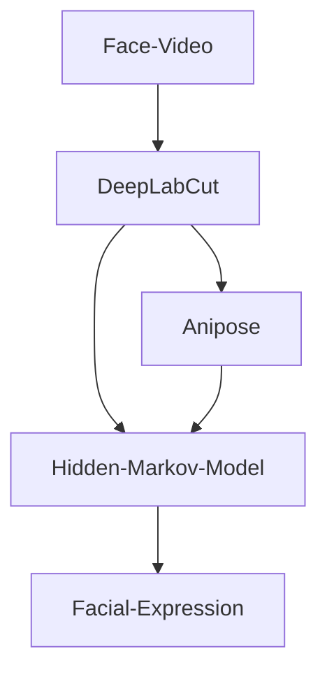

During the past year we have all been using zoom, webex and skype to keep up with work, meetings or classes. Most of us probably more frequently and in longer sessions than we would have preferred. Those of us using the camera during virtual meetings will have noticed one thing: our own face video, incessantly looking back at us. More often than not looking quite weird, honestly. Do we always look like that? Let’s find out.
With this short guide you can upgrade your next zoom meeting with some facial expression analysis to check your most common faces when you are talking to your computer.  



Technically, you will only need a simple face video recorded with your smartphone, action cam or a webcam. To make things more interesting though, I used a synchronized two-camera setup for multi-view recording and 3D reconstruction. But you can keep your analysis 2D changing only a few parameters along the road.



## Using DeepLabCut for markerless tracking

Now that you recorded yourself during your virtual meeting, you will need to track the movement of your eyebrows, lips, corners of your mouth etc. in image coordinates over many frames. And this is where you will want to check out [**DeepLabCut**](http://www.mousemotorlab.org/deeplabcut). Deeplabcut is an open source package for markerless pose estimation based on transfer learning with deep neural networks ([Mathis et al., 2020](https://doi.org/10.1016/j.neuron.2020.09.017)). It is somewhat tricky to install, but they have compiled really extensive resources in the last year, with online workshops and tutorials. You will definitely not regret the time you spend learning to use DeepLabCut (check out their [installation guide](https://github.com/DeepLabCut/DeepLabCut/blob/master/docs/installation.md)).

After installing you want to start a new project, load your videos and manually label a few frames. You may want to check useful facial landmarks from other popular face detection approaches like [**OpenFace**](https://github.com/TadasBaltrusaitis/OpenFace). 



After manually labelling some of the video frames you can start training your own model. Alternatively, you can use my pre-trained model and see if it tracks you too (see [here](https://github.com/Guillermo-Hidalgo-Gadea/UQOAB/tree/main/Facial%20Expression%20Analysis/DeepLabCut/exported-models)). Now that your very own deep neural network model has learned to detect your customized labels, you can analyze the entire video (and every future face video you will record) for fast and robust markerless pose estimation.

**Note**: You may want to use several videos and even some different videos from friends and collogues to make your model more robust. You probably want the final model to learn a more abstract form of “left eye” and not only to detect your very own left eye from a very specific perspective.

## Using Anipose for triangulation and 3D reconstruction

Although DeepLabCut has recently implemented its own 3D pose estimation, I recommend using Anipose for robust triangulation and 3D reconstruction. [**Anipose**](https://anipose.readthedocs.io/en/latest/) is an open source toolkit specially developed to combine several DeepLabCut videos from different perspectives and generate smooth 3D tracking after camera triangulation . If you managed to install DeepLabCut, installing Anipose should be an easy add on. Please check the installation guide and the how-to’s on their website.



The final product will hopefully look something like this. And in addition to the cool video output, you will have a long csv file with your time series data. Each line will consist of the x-, y- and z-coordinates of each marker on the given frame. This is the data you want to open in R for the last analysis step. 

## Hidden Markov Models for classification of time series data
A markov chain is a very simple stochastic model for unsupervised machine learning. The intuition is a classification of a number of unknown states that could either transition from one to another (e.g., after smiling comes often a neutral face) or self-transition to a prolonged state (e.g., the sad face is usually maintained before smiling). Hidden markov models further assume that the state itself is unobservable/hidden (e.g., happiness) but can be described by other observable variables (e.g., smiling face).  
After loading your data in Phython and running some quick pre-processing you want to train a markov model with your time series data with the following code: 

```python
from hmmlearn import hmm

model = hmm.GaussianHMM(n_components = 9, covariance_type="full") 
model.fit(data)
prediction = model1.predict(data)
```

Check my [Python script](https://github.com/Guillermo-Hidalgo-Gadea/UQOAB/tree/main/Facial%20Expression%20Analysis) to follow along. You can then classify your own time series data with the newly trained HMM to extract the most conspicuous facial expressions from you video. From here on, the sky is the limit. You may want to check some great work in computational neuroethology for some inspiration ([Luxem et al., 2020](https://doi.org/10.1101/2020.05.14.095430); [Marshall et al., 2021](https://doi.org/10.1016/j.neuron.2020.11.016)). But for starters, it may be useful to plot the average facial expression in each class:



You may even want to analyze the raw coordinates to calculate kinematics like head movement and speed. You could try to find similarities and differences between the facial expressions, as well as finding order in a typical sequence of facial expressions.





Last but not least, I recommend you count the absolute and relative frequency of each facial expression to have an idea of how often you are doing that specific weird face in zoom meetings.

*Let me know on [Twitter](https://twitter.com/G_HidalgoGadea) if you found this guide useful or would like to have a more detailed discussion on any of the methods used above.*
