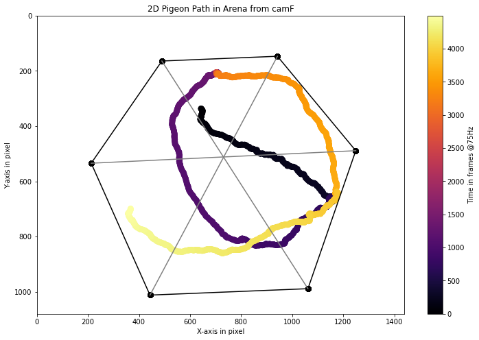

This Notebook is intended to help extract coordinate data from h5 and csv files before and after DeepLabCut and Anipose analyses. Specifically, pose coordinates and arena reference coordinates are analyzed separately, and need to be merged before triangulation.

```python
# import 
import os
import pandas as pd
import numpy as np
import matplotlib.pyplot as plt
import tkinter
import tkinter.filedialog
```

## 1. Read pose data

First test with data from '20220201_HexagonalArena_P175'
see reference data here: F:\HexagonalArena_local\ArenaReference\20220201_P175
and pose data here: F:\PigeonTriangulation_local\hexArenaLoc\trial3\pose-2d


```python
poseref = r'F:\PigeonTriangulation_local\hexArenaLoc\trial3\pose-2d'
arenaref = r'F:\HexagonalArena_local\ArenaReference\20220201_P175'
```


```python
# read data in h5 format
posefile = tkinter.filedialog.askopenfilename(initialdir = poseref ,title = "Select a h5 pose file:")
df_pose = pd.read_hdf(posefile)
df_pose
```


<div>
<style scoped>
    .dataframe tbody tr th:only-of-type {
        vertical-align: middle;
    }

    .dataframe tbody tr th {
        vertical-align: top;
    }

    .dataframe thead tr th {
        text-align: left;
    }
</style>
<table border="1" class="dataframe">
  <thead>
    <tr>
      <th>scorer</th>
      <th colspan="21" halign="left">DLC_resnet101_PigeonSuperModel_01Nov4shuffle1_2000000</th>
    </tr>
    <tr>
      <th>bodyparts</th>
      <th colspan="3" halign="left">US(UpperSpine=LN)</th>
      <th colspan="3" halign="left">LS(LowerSpine)</th>
      <th colspan="3" halign="left">MS(MiddleSpine)</th>
      <th>UHS(UpperHalfSpine)</th>
      <th>...</th>
      <th>LF(LeftFoot)</th>
      <th colspan="3" halign="left">RT(RightTibia)</th>
      <th colspan="3" halign="left">RA(RightAnkle)</th>
      <th colspan="3" halign="left">RF(RightFoot)</th>
    </tr>
    <tr>
      <th>coords</th>
      <th>x</th>
      <th>y</th>
      <th>likelihood</th>
      <th>x</th>
      <th>y</th>
      <th>likelihood</th>
      <th>x</th>
      <th>y</th>
      <th>likelihood</th>
      <th>x</th>
      <th>...</th>
      <th>likelihood</th>
      <th>x</th>
      <th>y</th>
      <th>likelihood</th>
      <th>x</th>
      <th>y</th>
      <th>likelihood</th>
      <th>x</th>
      <th>y</th>
      <th>likelihood</th>
    </tr>
  </thead>
  <tbody>
    <tr>
      <th>0</th>
      <td>640.989230</td>
      <td>344.466683</td>
      <td>0.916727</td>
      <td>645.478724</td>
      <td>303.430606</td>
      <td>0.796740</td>
      <td>644.039045</td>
      <td>327.999838</td>
      <td>0.287272</td>
      <td>643.403307</td>
      <td>...</td>
      <td>0.598591</td>
      <td>628.180593</td>
      <td>374.697701</td>
      <td>0.001180</td>
      <td>633.750403</td>
      <td>378.864707</td>
      <td>0.049644</td>
      <td>636.643647</td>
      <td>384.798370</td>
      <td>0.043503</td>
    </tr>
    <tr>
      <th>1</th>
      <td>640.797319</td>
      <td>344.915719</td>
      <td>0.908827</td>
      <td>646.744630</td>
      <td>304.058914</td>
      <td>0.750711</td>
      <td>644.789697</td>
      <td>328.150457</td>
      <td>0.294618</td>
      <td>643.372980</td>
      <td>...</td>
      <td>0.668564</td>
      <td>627.937303</td>
      <td>374.865241</td>
      <td>0.001080</td>
      <td>633.416549</td>
      <td>379.330903</td>
      <td>0.046224</td>
      <td>636.276155</td>
      <td>385.197161</td>
      <td>0.045036</td>
    </tr>
    <tr>
      <th>2</th>
      <td>640.351147</td>
      <td>345.349218</td>
      <td>0.892289</td>
      <td>649.796389</td>
      <td>304.715229</td>
      <td>0.771619</td>
      <td>646.153409</td>
      <td>329.591538</td>
      <td>0.321961</td>
      <td>643.505822</td>
      <td>...</td>
      <td>0.698718</td>
      <td>627.714704</td>
      <td>375.242991</td>
      <td>0.000919</td>
      <td>632.968455</td>
      <td>379.741385</td>
      <td>0.044202</td>
      <td>635.926070</td>
      <td>385.503910</td>
      <td>0.042140</td>
    </tr>
    <tr>
      <th>3</th>
      <td>640.055052</td>
      <td>345.765333</td>
      <td>0.888938</td>
      <td>650.429135</td>
      <td>305.198964</td>
      <td>0.846084</td>
      <td>646.828756</td>
      <td>329.627438</td>
      <td>0.435219</td>
      <td>643.754732</td>
      <td>...</td>
      <td>0.740604</td>
      <td>626.641231</td>
      <td>381.648432</td>
      <td>0.000836</td>
      <td>628.975853</td>
      <td>376.691483</td>
      <td>0.035905</td>
      <td>635.824578</td>
      <td>386.164546</td>
      <td>0.038487</td>
    </tr>
    <tr>
      <th>4</th>
      <td>640.117920</td>
      <td>346.160631</td>
      <td>0.904219</td>
      <td>651.150858</td>
      <td>305.977508</td>
      <td>0.893099</td>
      <td>647.577388</td>
      <td>329.356055</td>
      <td>0.518741</td>
      <td>644.139544</td>
      <td>...</td>
      <td>0.786127</td>
      <td>626.529260</td>
      <td>382.037743</td>
      <td>0.000849</td>
      <td>628.322321</td>
      <td>377.500684</td>
      <td>0.033018</td>
      <td>629.702227</td>
      <td>381.178766</td>
      <td>0.033214</td>
    </tr>
    <tr>
      <th>...</th>
      <td>...</td>
      <td>...</td>
      <td>...</td>
      <td>...</td>
      <td>...</td>
      <td>...</td>
      <td>...</td>
      <td>...</td>
      <td>...</td>
      <td>...</td>
      <td>...</td>
      <td>...</td>
      <td>...</td>
      <td>...</td>
      <td>...</td>
      <td>...</td>
      <td>...</td>
      <td>...</td>
      <td>...</td>
      <td>...</td>
      <td>...</td>
    </tr>
    <tr>
      <th>4495</th>
      <td>367.769209</td>
      <td>687.466753</td>
      <td>0.984717</td>
      <td>367.728103</td>
      <td>758.201678</td>
      <td>0.999123</td>
      <td>369.199896</td>
      <td>722.016626</td>
      <td>0.983162</td>
      <td>367.103288</td>
      <td>...</td>
      <td>0.022135</td>
      <td>386.145338</td>
      <td>705.711202</td>
      <td>0.003760</td>
      <td>392.220677</td>
      <td>710.374468</td>
      <td>0.007978</td>
      <td>399.456751</td>
      <td>718.533674</td>
      <td>0.048256</td>
    </tr>
    <tr>
      <th>4496</th>
      <td>367.091518</td>
      <td>685.363973</td>
      <td>0.983964</td>
      <td>366.850518</td>
      <td>756.647971</td>
      <td>0.998817</td>
      <td>369.054607</td>
      <td>720.689996</td>
      <td>0.983464</td>
      <td>367.418953</td>
      <td>...</td>
      <td>0.020133</td>
      <td>387.194076</td>
      <td>710.379325</td>
      <td>0.004266</td>
      <td>392.832224</td>
      <td>710.062842</td>
      <td>0.012081</td>
      <td>399.656763</td>
      <td>718.277183</td>
      <td>0.072161</td>
    </tr>
    <tr>
      <th>4497</th>
      <td>367.228496</td>
      <td>683.859409</td>
      <td>0.986913</td>
      <td>366.698533</td>
      <td>755.202582</td>
      <td>0.998526</td>
      <td>369.000118</td>
      <td>719.656308</td>
      <td>0.985458</td>
      <td>366.602570</td>
      <td>...</td>
      <td>0.022452</td>
      <td>388.079372</td>
      <td>710.111514</td>
      <td>0.003995</td>
      <td>393.741371</td>
      <td>709.861259</td>
      <td>0.014392</td>
      <td>399.776065</td>
      <td>717.720548</td>
      <td>0.078897</td>
    </tr>
    <tr>
      <th>4498</th>
      <td>368.281775</td>
      <td>682.548541</td>
      <td>0.990507</td>
      <td>365.685280</td>
      <td>753.781854</td>
      <td>0.998077</td>
      <td>368.827694</td>
      <td>718.538765</td>
      <td>0.984765</td>
      <td>367.268499</td>
      <td>...</td>
      <td>0.022139</td>
      <td>382.695207</td>
      <td>695.962629</td>
      <td>0.004598</td>
      <td>394.720343</td>
      <td>709.277210</td>
      <td>0.016931</td>
      <td>402.272774</td>
      <td>709.047721</td>
      <td>0.082674</td>
    </tr>
    <tr>
      <th>4499</th>
      <td>368.867873</td>
      <td>681.521099</td>
      <td>0.991017</td>
      <td>364.851850</td>
      <td>750.338995</td>
      <td>0.997715</td>
      <td>368.473056</td>
      <td>717.533381</td>
      <td>0.971233</td>
      <td>367.376853</td>
      <td>...</td>
      <td>0.025810</td>
      <td>382.958216</td>
      <td>695.729021</td>
      <td>0.006906</td>
      <td>395.227382</td>
      <td>708.605062</td>
      <td>0.027885</td>
      <td>402.601397</td>
      <td>708.505238</td>
      <td>0.128176</td>
    </tr>
  </tbody>
</table>
<p>4500 rows × 117 columns</p>
</div>


## 2. Read Arena Reference Data

Load arena reference pose for given camera


```python
# read data in h5 format
reffile = tkinter.filedialog.askopenfilename(initialdir = arenaref ,title = "Select a h5 pose file:")
df_ref = pd.read_hdf(reffile)
df_ref
```


<div>
<style scoped>
    .dataframe tbody tr th:only-of-type {
        vertical-align: middle;
    }

    .dataframe tbody tr th {
        vertical-align: top;
    }

    .dataframe thead tr th {
        text-align: left;
    }
</style>
<table border="1" class="dataframe">
  <thead>
    <tr>
      <th>scorer</th>
      <th colspan="18" halign="left">DLC_resnet50_Hex_refMar1shuffle1_1000000</th>
    </tr>
    <tr>
      <th>bodyparts</th>
      <th colspan="3" halign="left">cA</th>
      <th colspan="3" halign="left">cB</th>
      <th colspan="3" halign="left">cC</th>
      <th colspan="3" halign="left">cD</th>
      <th colspan="3" halign="left">cE</th>
      <th colspan="3" halign="left">cF</th>
    </tr>
    <tr>
      <th>coords</th>
      <th>x</th>
      <th>y</th>
      <th>likelihood</th>
      <th>x</th>
      <th>y</th>
      <th>likelihood</th>
      <th>x</th>
      <th>y</th>
      <th>likelihood</th>
      <th>x</th>
      <th>y</th>
      <th>likelihood</th>
      <th>x</th>
      <th>y</th>
      <th>likelihood</th>
      <th>x</th>
      <th>y</th>
      <th>likelihood</th>
    </tr>
  </thead>
  <tbody>
    <tr>
      <th>0</th>
      <td>1061.839355</td>
      <td>989.153809</td>
      <td>0.999989</td>
      <td>443.004608</td>
      <td>1012.047302</td>
      <td>0.999962</td>
      <td>212.833771</td>
      <td>534.219910</td>
      <td>0.999937</td>
      <td>489.620056</td>
      <td>164.377884</td>
      <td>0.999988</td>
      <td>942.481323</td>
      <td>146.626602</td>
      <td>0.999985</td>
      <td>1249.303955</td>
      <td>488.789307</td>
      <td>0.999930</td>
    </tr>
    <tr>
      <th>1</th>
      <td>1061.846069</td>
      <td>989.112366</td>
      <td>0.999990</td>
      <td>443.032837</td>
      <td>1012.004639</td>
      <td>0.999964</td>
      <td>212.880737</td>
      <td>534.243347</td>
      <td>0.999933</td>
      <td>489.579468</td>
      <td>164.559708</td>
      <td>0.999987</td>
      <td>942.488586</td>
      <td>146.669739</td>
      <td>0.999985</td>
      <td>1249.282593</td>
      <td>488.855804</td>
      <td>0.999933</td>
    </tr>
    <tr>
      <th>2</th>
      <td>1061.864502</td>
      <td>989.131165</td>
      <td>0.999990</td>
      <td>443.025574</td>
      <td>1011.989929</td>
      <td>0.999964</td>
      <td>212.875275</td>
      <td>534.236328</td>
      <td>0.999932</td>
      <td>489.572418</td>
      <td>164.369034</td>
      <td>0.999987</td>
      <td>942.502686</td>
      <td>146.641968</td>
      <td>0.999986</td>
      <td>1249.276733</td>
      <td>488.854431</td>
      <td>0.999932</td>
    </tr>
    <tr>
      <th>3</th>
      <td>1061.853882</td>
      <td>989.137878</td>
      <td>0.999990</td>
      <td>443.019714</td>
      <td>1012.013428</td>
      <td>0.999964</td>
      <td>212.896439</td>
      <td>534.219299</td>
      <td>0.999931</td>
      <td>489.637970</td>
      <td>164.421173</td>
      <td>0.999987</td>
      <td>942.525024</td>
      <td>146.611115</td>
      <td>0.999985</td>
      <td>1249.277222</td>
      <td>488.855377</td>
      <td>0.999932</td>
    </tr>
    <tr>
      <th>4</th>
      <td>1061.848999</td>
      <td>989.155518</td>
      <td>0.999990</td>
      <td>443.021393</td>
      <td>1012.016235</td>
      <td>0.999964</td>
      <td>212.874298</td>
      <td>534.204895</td>
      <td>0.999933</td>
      <td>489.602966</td>
      <td>164.442780</td>
      <td>0.999988</td>
      <td>942.515137</td>
      <td>146.610626</td>
      <td>0.999985</td>
      <td>1249.285156</td>
      <td>488.831482</td>
      <td>0.999932</td>
    </tr>
    <tr>
      <th>...</th>
      <td>...</td>
      <td>...</td>
      <td>...</td>
      <td>...</td>
      <td>...</td>
      <td>...</td>
      <td>...</td>
      <td>...</td>
      <td>...</td>
      <td>...</td>
      <td>...</td>
      <td>...</td>
      <td>...</td>
      <td>...</td>
      <td>...</td>
      <td>...</td>
      <td>...</td>
      <td>...</td>
    </tr>
    <tr>
      <th>898</th>
      <td>1061.932007</td>
      <td>988.934814</td>
      <td>0.999991</td>
      <td>443.145477</td>
      <td>1012.229858</td>
      <td>0.999964</td>
      <td>212.982803</td>
      <td>534.407654</td>
      <td>0.999882</td>
      <td>489.948700</td>
      <td>163.941986</td>
      <td>0.999979</td>
      <td>942.387878</td>
      <td>146.916641</td>
      <td>0.999985</td>
      <td>1249.421631</td>
      <td>489.090851</td>
      <td>0.999926</td>
    </tr>
    <tr>
      <th>899</th>
      <td>1061.925415</td>
      <td>988.930481</td>
      <td>0.999991</td>
      <td>443.146484</td>
      <td>1012.234985</td>
      <td>0.999964</td>
      <td>212.978928</td>
      <td>534.405823</td>
      <td>0.999881</td>
      <td>489.947968</td>
      <td>163.950378</td>
      <td>0.999979</td>
      <td>942.142090</td>
      <td>146.939957</td>
      <td>0.999986</td>
      <td>1249.423706</td>
      <td>489.098511</td>
      <td>0.999927</td>
    </tr>
    <tr>
      <th>900</th>
      <td>1061.877563</td>
      <td>988.915161</td>
      <td>0.999992</td>
      <td>443.235992</td>
      <td>1012.176941</td>
      <td>0.999959</td>
      <td>212.847198</td>
      <td>534.518127</td>
      <td>0.999928</td>
      <td>489.865662</td>
      <td>164.063965</td>
      <td>0.999979</td>
      <td>942.376587</td>
      <td>146.910904</td>
      <td>0.999985</td>
      <td>1249.352295</td>
      <td>489.128510</td>
      <td>0.999928</td>
    </tr>
    <tr>
      <th>901</th>
      <td>1061.883545</td>
      <td>988.912720</td>
      <td>0.999992</td>
      <td>443.234283</td>
      <td>1012.165466</td>
      <td>0.999960</td>
      <td>212.850342</td>
      <td>534.518311</td>
      <td>0.999927</td>
      <td>489.856781</td>
      <td>164.062897</td>
      <td>0.999979</td>
      <td>942.372131</td>
      <td>146.899994</td>
      <td>0.999985</td>
      <td>1249.352417</td>
      <td>489.131683</td>
      <td>0.999928</td>
    </tr>
    <tr>
      <th>902</th>
      <td>1061.877930</td>
      <td>988.921265</td>
      <td>0.999992</td>
      <td>443.233826</td>
      <td>1012.173462</td>
      <td>0.999959</td>
      <td>212.848892</td>
      <td>534.520264</td>
      <td>0.999927</td>
      <td>489.859497</td>
      <td>164.063477</td>
      <td>0.999979</td>
      <td>942.366394</td>
      <td>146.908203</td>
      <td>0.999985</td>
      <td>1249.353760</td>
      <td>489.125763</td>
      <td>0.999928</td>
    </tr>
  </tbody>
</table>
<p>903 rows × 18 columns</p>
</div>


## Calculate stable points for arena
assume median or mode (?) is the best representation of stable point


```python
#df_ref["DLC_resnet50_Hex_refMar1shuffle1_1000000", "cA", "x"].plot()
```


```python
# calculate median for every column in dataframe
median = np.array(df_ref.median(axis=0, skipna=True)).reshape((1,18))
length = len(df_pose)

scorers = list(df_pose.columns.levels[0])

# stretch median to length of pose df
stable = pd.concat([pd.DataFrame(median, columns=pd.MultiIndex.from_product([scorers, ['cA','cB','cC','cD','cE','cF'], ['x','y','likelihood']]))]*length, ignore_index=True)
stable.columns.names = ['scorer', 'bodyparts', 'coords']
#stable
```


```python
# check stability of point
#plt.plot(stable["PostProcessed_gh", "cA", "x"])
```

## 3. Merge Datasets


```python
merged = stable.join(df_pose)
#merged
```


```python
outputdir = r'F:\PigeonTriangulation_local\HexagonalArena\20220201_P175\trial2\pose-2d'
# save merged data
outputfile = outputdir + '/' + 'merged_' + os.path.basename(posefile)
merged.to_hdf(outputfile, key ='df', mode='w')
```

## Automated Process


```python
# file scrapping function to find all files in directory
def scrap_dir(extension, dir):
    # Select directory
    filelist= list()
    # Within this directory find all nested files
    for (dirpath, dirname, filename) in os.walk(dir):
        filelist += [os.path.join(dirpath,file) for file in filename]
    # Subset only video files
    extensionlist= [file for file in filelist if extension in file]
    # Give list
    print(f'{len(extensionlist)} files selected from {dirpath}.')
    return extensionlist

# start automated loop by selecting directories
pose_files = scrap_dir('.h5', tkinter.filedialog.askdirectory(title="Select POSE directory:"))
arena_files = scrap_dir('.h5', tkinter.filedialog.askdirectory(title="Select REFERENCE directory:"))
outputdir = tkinter.filedialog.askdirectory(title="Select OUTPUT directory:")

length = len(pose_files)
length2 = len(arena_files)
if length == length2:
    for i in range(length):
        # read data
        arena = pd.read_hdf(arena_files[i]) # this assumes both lists are sorted identically
        pose = pd.read_hdf(pose_files[i])

        # calculate stable point as median
        median = np.array(arena.median(axis=0, skipna=True)).reshape((1,18))
        length = len(pose)
        scorers = list(pose.columns.levels[0])
        
        # stretch median to length of pose df
        stable = pd.concat([pd.DataFrame(median, columns=pd.MultiIndex.from_product([scorers, ['cA','cB','cC','cD','cE','cF'], ['x','y','likelihood']]))]*length, ignore_index=True)
        stable.columns.names = ['scorer', 'bodyparts', 'coords']

        # merge pose and stable points
        merged = stable.join(pose)

        # save merged data
        # save merged data
        outputfile = outputdir + '/' + 'merged_' + os.path.basename(pose_files[i])
        merged.to_hdf(outputfile, key ='df', mode='w')
        
else:
    print("Directory lists do not match")
```

    The function scrap_dir() successfully selected 6 videos.
    The function scrap_dir() successfully selected 6 videos.


## Lets see how the data looks like
Since 3D tracking is still very raw and unfiltered, use data from a single camera in 2D to check basic structure


```python
# read merged h5
file = tkinter.filedialog.askopenfilename(initialdir = "/",title = "Select a pose file:")
df = pd.read_hdf(file)

# flatten h5 structure
new_col_names = list(df.columns.get_level_values(
    1) + '_' + df.columns.get_level_values(2))
df.columns = new_col_names
df
```


<div>
<style scoped>
    .dataframe tbody tr th:only-of-type {
        vertical-align: middle;
    }

    .dataframe tbody tr th {
        vertical-align: top;
    }

    .dataframe thead th {
        text-align: right;
    }
</style>
<table border="1" class="dataframe">
  <thead>
    <tr style="text-align: right;">
      <th></th>
      <th>cA_x</th>
      <th>cA_y</th>
      <th>cA_likelihood</th>
      <th>cB_x</th>
      <th>cB_y</th>
      <th>cB_likelihood</th>
      <th>cC_x</th>
      <th>cC_y</th>
      <th>cC_likelihood</th>
      <th>cD_x</th>
      <th>...</th>
      <th>LF(LeftFoot)_likelihood</th>
      <th>RT(RightTibia)_x</th>
      <th>RT(RightTibia)_y</th>
      <th>RT(RightTibia)_likelihood</th>
      <th>RA(RightAnkle)_x</th>
      <th>RA(RightAnkle)_y</th>
      <th>RA(RightAnkle)_likelihood</th>
      <th>RF(RightFoot)_x</th>
      <th>RF(RightFoot)_y</th>
      <th>RF(RightFoot)_likelihood</th>
    </tr>
  </thead>
  <tbody>
    <tr>
      <th>0</th>
      <td>1061.904297</td>
      <td>988.944214</td>
      <td>0.999991</td>
      <td>443.155304</td>
      <td>1012.189453</td>
      <td>0.999963</td>
      <td>212.91803</td>
      <td>534.392273</td>
      <td>0.999909</td>
      <td>489.750122</td>
      <td>...</td>
      <td>0.598591</td>
      <td>628.180593</td>
      <td>374.697701</td>
      <td>0.001180</td>
      <td>633.750403</td>
      <td>378.864707</td>
      <td>0.049644</td>
      <td>636.643647</td>
      <td>384.798370</td>
      <td>0.043503</td>
    </tr>
    <tr>
      <th>1</th>
      <td>1061.904297</td>
      <td>988.944214</td>
      <td>0.999991</td>
      <td>443.155304</td>
      <td>1012.189453</td>
      <td>0.999963</td>
      <td>212.91803</td>
      <td>534.392273</td>
      <td>0.999909</td>
      <td>489.750122</td>
      <td>...</td>
      <td>0.668564</td>
      <td>627.937303</td>
      <td>374.865241</td>
      <td>0.001080</td>
      <td>633.416549</td>
      <td>379.330903</td>
      <td>0.046224</td>
      <td>636.276155</td>
      <td>385.197161</td>
      <td>0.045036</td>
    </tr>
    <tr>
      <th>2</th>
      <td>1061.904297</td>
      <td>988.944214</td>
      <td>0.999991</td>
      <td>443.155304</td>
      <td>1012.189453</td>
      <td>0.999963</td>
      <td>212.91803</td>
      <td>534.392273</td>
      <td>0.999909</td>
      <td>489.750122</td>
      <td>...</td>
      <td>0.698718</td>
      <td>627.714704</td>
      <td>375.242991</td>
      <td>0.000919</td>
      <td>632.968455</td>
      <td>379.741385</td>
      <td>0.044202</td>
      <td>635.926070</td>
      <td>385.503910</td>
      <td>0.042140</td>
    </tr>
    <tr>
      <th>3</th>
      <td>1061.904297</td>
      <td>988.944214</td>
      <td>0.999991</td>
      <td>443.155304</td>
      <td>1012.189453</td>
      <td>0.999963</td>
      <td>212.91803</td>
      <td>534.392273</td>
      <td>0.999909</td>
      <td>489.750122</td>
      <td>...</td>
      <td>0.740604</td>
      <td>626.641231</td>
      <td>381.648432</td>
      <td>0.000836</td>
      <td>628.975853</td>
      <td>376.691483</td>
      <td>0.035905</td>
      <td>635.824578</td>
      <td>386.164546</td>
      <td>0.038487</td>
    </tr>
    <tr>
      <th>4</th>
      <td>1061.904297</td>
      <td>988.944214</td>
      <td>0.999991</td>
      <td>443.155304</td>
      <td>1012.189453</td>
      <td>0.999963</td>
      <td>212.91803</td>
      <td>534.392273</td>
      <td>0.999909</td>
      <td>489.750122</td>
      <td>...</td>
      <td>0.786127</td>
      <td>626.529260</td>
      <td>382.037743</td>
      <td>0.000849</td>
      <td>628.322321</td>
      <td>377.500684</td>
      <td>0.033018</td>
      <td>629.702227</td>
      <td>381.178766</td>
      <td>0.033214</td>
    </tr>
    <tr>
      <th>...</th>
      <td>...</td>
      <td>...</td>
      <td>...</td>
      <td>...</td>
      <td>...</td>
      <td>...</td>
      <td>...</td>
      <td>...</td>
      <td>...</td>
      <td>...</td>
      <td>...</td>
      <td>...</td>
      <td>...</td>
      <td>...</td>
      <td>...</td>
      <td>...</td>
      <td>...</td>
      <td>...</td>
      <td>...</td>
      <td>...</td>
      <td>...</td>
    </tr>
    <tr>
      <th>4495</th>
      <td>1061.904297</td>
      <td>988.944214</td>
      <td>0.999991</td>
      <td>443.155304</td>
      <td>1012.189453</td>
      <td>0.999963</td>
      <td>212.91803</td>
      <td>534.392273</td>
      <td>0.999909</td>
      <td>489.750122</td>
      <td>...</td>
      <td>0.022135</td>
      <td>386.145338</td>
      <td>705.711202</td>
      <td>0.003760</td>
      <td>392.220677</td>
      <td>710.374468</td>
      <td>0.007978</td>
      <td>399.456751</td>
      <td>718.533674</td>
      <td>0.048256</td>
    </tr>
    <tr>
      <th>4496</th>
      <td>1061.904297</td>
      <td>988.944214</td>
      <td>0.999991</td>
      <td>443.155304</td>
      <td>1012.189453</td>
      <td>0.999963</td>
      <td>212.91803</td>
      <td>534.392273</td>
      <td>0.999909</td>
      <td>489.750122</td>
      <td>...</td>
      <td>0.020133</td>
      <td>387.194076</td>
      <td>710.379325</td>
      <td>0.004266</td>
      <td>392.832224</td>
      <td>710.062842</td>
      <td>0.012081</td>
      <td>399.656763</td>
      <td>718.277183</td>
      <td>0.072161</td>
    </tr>
    <tr>
      <th>4497</th>
      <td>1061.904297</td>
      <td>988.944214</td>
      <td>0.999991</td>
      <td>443.155304</td>
      <td>1012.189453</td>
      <td>0.999963</td>
      <td>212.91803</td>
      <td>534.392273</td>
      <td>0.999909</td>
      <td>489.750122</td>
      <td>...</td>
      <td>0.022452</td>
      <td>388.079372</td>
      <td>710.111514</td>
      <td>0.003995</td>
      <td>393.741371</td>
      <td>709.861259</td>
      <td>0.014392</td>
      <td>399.776065</td>
      <td>717.720548</td>
      <td>0.078897</td>
    </tr>
    <tr>
      <th>4498</th>
      <td>1061.904297</td>
      <td>988.944214</td>
      <td>0.999991</td>
      <td>443.155304</td>
      <td>1012.189453</td>
      <td>0.999963</td>
      <td>212.91803</td>
      <td>534.392273</td>
      <td>0.999909</td>
      <td>489.750122</td>
      <td>...</td>
      <td>0.022139</td>
      <td>382.695207</td>
      <td>695.962629</td>
      <td>0.004598</td>
      <td>394.720343</td>
      <td>709.277210</td>
      <td>0.016931</td>
      <td>402.272774</td>
      <td>709.047721</td>
      <td>0.082674</td>
    </tr>
    <tr>
      <th>4499</th>
      <td>1061.904297</td>
      <td>988.944214</td>
      <td>0.999991</td>
      <td>443.155304</td>
      <td>1012.189453</td>
      <td>0.999963</td>
      <td>212.91803</td>
      <td>534.392273</td>
      <td>0.999909</td>
      <td>489.750122</td>
      <td>...</td>
      <td>0.025810</td>
      <td>382.958216</td>
      <td>695.729021</td>
      <td>0.006906</td>
      <td>395.227382</td>
      <td>708.605062</td>
      <td>0.027885</td>
      <td>402.601397</td>
      <td>708.505238</td>
      <td>0.128176</td>
    </tr>
  </tbody>
</table>
<p>4500 rows × 135 columns</p>
</div>


```python
# define data
arena = df.iloc[:,0:18]
pigeon = df.loc[:, df.columns.str.contains('UHS')]

cam = file[-7:-3]

# select coordinates
arena_x = arena.loc[:,arena.columns.str.contains('_x')]
arena_y = arena.loc[:,arena.columns.str.contains('_y')]

pigeon_x = pigeon.loc[:,pigeon.columns.str.contains('_x')]
pigeon_y = pigeon.loc[:,pigeon.columns.str.contains('_y')]
t = [t for t in range(len(pigeon_x))]

#center = [770.8, 520.8]

x_border = np.append(np.array(arena_x)[0, :],np.array(arena_x)[0,0])
y_border = np.append(np.array(arena_y)[0, :],np.array(arena_y)[0,0])
d1x = np.append(np.array(arena_x)[0,0],np.array(arena_x)[0,3])
d1y = np.append(np.array(arena_y)[0,0],np.array(arena_y)[0,3])
d2x = np.append(np.array(arena_x)[0,1],np.array(arena_x)[0,4])
d2y = np.append(np.array(arena_y)[0,1],np.array(arena_y)[0,4])
d3x = np.append(np.array(arena_x)[0,2],np.array(arena_x)[0,5])
d3y = np.append(np.array(arena_y)[0,2],np.array(arena_y)[0,5])

# creating 2d figures
figure, ax = plt.subplots(figsize=(12, 8))

# creating the path map
img = plt.scatter(pigeon_x, pigeon_y, c = t, cmap = 'inferno', marker='o', s=60)

# plotting arena
plt.scatter(arena_x, arena_y, color='black', marker='h', s=60)
#plt.scatter(center[0], center[1], marker='h', color='gray')
plt.plot(x_border, y_border, color='black')

#plotting diagonals
plt.plot(d1x, d1y, color='gray')
plt.plot(d2x, d2y, color='gray')
plt.plot(d3x, d3y, color='gray')

# adding title and labels
ax.set_title(f"2D Pigeon Path in Arena from {cam}")
ax.set_xlabel('X-axis in pixel')
ax.set_ylabel('Y-axis in pixel')

ax.set_xlim(0,1440)
ax.set_ylim(1080,0)

# displaying plot
#figure.colorbar();
# displaying plot
cbar = plt.colorbar(img)
cbar.ax.set_ylabel('Time in frames @75Hz')

filename = f"2DPath_{cam}.png"
plt.savefig(filename, format = 'png', dpi=500)

plt.show()
```


    

    


## Check Triangulated Data in 3D


```python
# read merged h5
file = tkinter.filedialog.askopenfilename(initialdir = "/",title = "Select a pose file:")
df = pd.read_csv(file)
df
```


<div>
<style scoped>
    .dataframe tbody tr th:only-of-type {
        vertical-align: middle;
    }

    .dataframe tbody tr th {
        vertical-align: top;
    }

    .dataframe thead th {
        text-align: right;
    }
</style>
<table border="1" class="dataframe">
  <thead>
    <tr style="text-align: right;">
      <th></th>
      <th>cA_x</th>
      <th>cA_y</th>
      <th>cA_z</th>
      <th>cA_error</th>
      <th>cA_ncams</th>
      <th>cA_score</th>
      <th>cB_x</th>
      <th>cB_y</th>
      <th>cB_z</th>
      <th>cB_error</th>
      <th>...</th>
      <th>M_10</th>
      <th>M_11</th>
      <th>M_12</th>
      <th>M_20</th>
      <th>M_21</th>
      <th>M_22</th>
      <th>center_0</th>
      <th>center_1</th>
      <th>center_2</th>
      <th>fnum</th>
    </tr>
  </thead>
  <tbody>
    <tr>
      <th>0</th>
      <td>0.0</td>
      <td>0.0</td>
      <td>0.0</td>
      <td>4.062387</td>
      <td>6.0</td>
      <td>0.999961</td>
      <td>1140.054753</td>
      <td>0.0</td>
      <td>4.547474e-13</td>
      <td>4.257522</td>
      <td>...</td>
      <td>0.113838</td>
      <td>0.913038</td>
      <td>-0.391666</td>
      <td>0.006729</td>
      <td>0.393511</td>
      <td>0.919295</td>
      <td>-590.503719</td>
      <td>-1900.547077</td>
      <td>1937.946886</td>
      <td>0</td>
    </tr>
    <tr>
      <th>1</th>
      <td>0.0</td>
      <td>0.0</td>
      <td>0.0</td>
      <td>4.062387</td>
      <td>6.0</td>
      <td>0.999961</td>
      <td>1140.054753</td>
      <td>0.0</td>
      <td>4.547474e-13</td>
      <td>4.257522</td>
      <td>...</td>
      <td>0.113838</td>
      <td>0.913038</td>
      <td>-0.391666</td>
      <td>0.006729</td>
      <td>0.393511</td>
      <td>0.919295</td>
      <td>-590.503719</td>
      <td>-1900.547077</td>
      <td>1937.946886</td>
      <td>1</td>
    </tr>
    <tr>
      <th>2</th>
      <td>0.0</td>
      <td>0.0</td>
      <td>0.0</td>
      <td>4.062387</td>
      <td>6.0</td>
      <td>0.999961</td>
      <td>1140.054753</td>
      <td>0.0</td>
      <td>4.547474e-13</td>
      <td>4.257522</td>
      <td>...</td>
      <td>0.113838</td>
      <td>0.913038</td>
      <td>-0.391666</td>
      <td>0.006729</td>
      <td>0.393511</td>
      <td>0.919295</td>
      <td>-590.503719</td>
      <td>-1900.547077</td>
      <td>1937.946886</td>
      <td>2</td>
    </tr>
    <tr>
      <th>3</th>
      <td>0.0</td>
      <td>0.0</td>
      <td>0.0</td>
      <td>4.062387</td>
      <td>6.0</td>
      <td>0.999961</td>
      <td>1140.054753</td>
      <td>0.0</td>
      <td>4.547474e-13</td>
      <td>4.257522</td>
      <td>...</td>
      <td>0.113838</td>
      <td>0.913038</td>
      <td>-0.391666</td>
      <td>0.006729</td>
      <td>0.393511</td>
      <td>0.919295</td>
      <td>-590.503719</td>
      <td>-1900.547077</td>
      <td>1937.946886</td>
      <td>3</td>
    </tr>
    <tr>
      <th>4</th>
      <td>0.0</td>
      <td>0.0</td>
      <td>0.0</td>
      <td>4.062387</td>
      <td>6.0</td>
      <td>0.999961</td>
      <td>1140.054753</td>
      <td>0.0</td>
      <td>4.547474e-13</td>
      <td>4.257522</td>
      <td>...</td>
      <td>0.113838</td>
      <td>0.913038</td>
      <td>-0.391666</td>
      <td>0.006729</td>
      <td>0.393511</td>
      <td>0.919295</td>
      <td>-590.503719</td>
      <td>-1900.547077</td>
      <td>1937.946886</td>
      <td>4</td>
    </tr>
    <tr>
      <th>...</th>
      <td>...</td>
      <td>...</td>
      <td>...</td>
      <td>...</td>
      <td>...</td>
      <td>...</td>
      <td>...</td>
      <td>...</td>
      <td>...</td>
      <td>...</td>
      <td>...</td>
      <td>...</td>
      <td>...</td>
      <td>...</td>
      <td>...</td>
      <td>...</td>
      <td>...</td>
      <td>...</td>
      <td>...</td>
      <td>...</td>
      <td>...</td>
    </tr>
    <tr>
      <th>4495</th>
      <td>0.0</td>
      <td>0.0</td>
      <td>0.0</td>
      <td>4.062387</td>
      <td>6.0</td>
      <td>0.999961</td>
      <td>1140.054753</td>
      <td>0.0</td>
      <td>4.547474e-13</td>
      <td>4.257522</td>
      <td>...</td>
      <td>0.113838</td>
      <td>0.913038</td>
      <td>-0.391666</td>
      <td>0.006729</td>
      <td>0.393511</td>
      <td>0.919295</td>
      <td>-590.503719</td>
      <td>-1900.547077</td>
      <td>1937.946886</td>
      <td>4495</td>
    </tr>
    <tr>
      <th>4496</th>
      <td>0.0</td>
      <td>0.0</td>
      <td>0.0</td>
      <td>4.062387</td>
      <td>6.0</td>
      <td>0.999961</td>
      <td>1140.054753</td>
      <td>0.0</td>
      <td>4.547474e-13</td>
      <td>4.257522</td>
      <td>...</td>
      <td>0.113838</td>
      <td>0.913038</td>
      <td>-0.391666</td>
      <td>0.006729</td>
      <td>0.393511</td>
      <td>0.919295</td>
      <td>-590.503719</td>
      <td>-1900.547077</td>
      <td>1937.946886</td>
      <td>4496</td>
    </tr>
    <tr>
      <th>4497</th>
      <td>0.0</td>
      <td>0.0</td>
      <td>0.0</td>
      <td>4.062387</td>
      <td>6.0</td>
      <td>0.999961</td>
      <td>1140.054753</td>
      <td>0.0</td>
      <td>4.547474e-13</td>
      <td>4.257522</td>
      <td>...</td>
      <td>0.113838</td>
      <td>0.913038</td>
      <td>-0.391666</td>
      <td>0.006729</td>
      <td>0.393511</td>
      <td>0.919295</td>
      <td>-590.503719</td>
      <td>-1900.547077</td>
      <td>1937.946886</td>
      <td>4497</td>
    </tr>
    <tr>
      <th>4498</th>
      <td>0.0</td>
      <td>0.0</td>
      <td>0.0</td>
      <td>4.062387</td>
      <td>6.0</td>
      <td>0.999961</td>
      <td>1140.054753</td>
      <td>0.0</td>
      <td>4.547474e-13</td>
      <td>4.257522</td>
      <td>...</td>
      <td>0.113838</td>
      <td>0.913038</td>
      <td>-0.391666</td>
      <td>0.006729</td>
      <td>0.393511</td>
      <td>0.919295</td>
      <td>-590.503719</td>
      <td>-1900.547077</td>
      <td>1937.946886</td>
      <td>4498</td>
    </tr>
    <tr>
      <th>4499</th>
      <td>0.0</td>
      <td>0.0</td>
      <td>0.0</td>
      <td>4.062387</td>
      <td>6.0</td>
      <td>0.999961</td>
      <td>1140.054753</td>
      <td>0.0</td>
      <td>4.547474e-13</td>
      <td>4.257522</td>
      <td>...</td>
      <td>0.113838</td>
      <td>0.913038</td>
      <td>-0.391666</td>
      <td>0.006729</td>
      <td>0.393511</td>
      <td>0.919295</td>
      <td>-590.503719</td>
      <td>-1900.547077</td>
      <td>1937.946886</td>
      <td>4499</td>
    </tr>
  </tbody>
</table>
<p>4500 rows × 283 columns</p>
</div>


```python
#%matplotlib qt
x = df.loc[:,df.columns.str.contains('_x')]
y = df.loc[:,df.columns.str.contains('_y')]
z = df.loc[:,df.columns.str.contains('_z')]

# creating 3d figures
fig = plt.figure(figsize=(10, 8))
ax = fig.add_subplot(projection='3d')
#ax.view_init(60, 45)

# creating the path map
img = ax.scatter(x.iloc[0,:], y.iloc[0,:], z.iloc[0,:], marker='o', s=60)

# adding title and labels
ax.set_title("3D Pigeon Path in Arena")
ax.set_xlabel('X-axis')
ax.set_ylabel('Y-axis')
ax.set_zlabel('Z-axis')

# displaying plot
#fig.colorbar(img)
plt.show()

```

## Check physical lengths


```python
# get coordinates for columnms
cA = np.array((df.loc[0,df.columns.str.contains('cA_x')], df.loc[0,df.columns.str.contains('cA_y')], df.loc[0,df.columns.str.contains('cA_z')]))
cB = np.array((df.loc[0,df.columns.str.contains('cB_x')], df.loc[0,df.columns.str.contains('cB_y')], df.loc[0,df.columns.str.contains('cB_z')]))
cC = np.array((df.loc[0,df.columns.str.contains('cC_x')], df.loc[0,df.columns.str.contains('cC_y')], df.loc[0,df.columns.str.contains('cC_z')]))
cD = np.array((df.loc[0,df.columns.str.contains('cD_x')], df.loc[0,df.columns.str.contains('cD_y')], df.loc[0,df.columns.str.contains('cD_z')]))
cE = np.array((df.loc[0,df.columns.str.contains('cE_x')], df.loc[0,df.columns.str.contains('cE_y')], df.loc[0,df.columns.str.contains('cE_z')]))
cF = np.array((df.loc[0,df.columns.str.contains('cF_x')], df.loc[0,df.columns.str.contains('cF_y')], df.loc[0,df.columns.str.contains('cF_z')]))
```


```python
# print side lengths
print(f"Length A-B: {format(np.linalg.norm(cA - cB),'.2f')} mm or {format(np.linalg.norm(cA - cB)/1000,'.2f')} m")
print(f"Length B-C: {format(np.linalg.norm(cB - cC),'.2f')} mm or {format(np.linalg.norm(cB - cC)/1000,'.2f')} m")
print(f"Length C-D: {format(np.linalg.norm(cC - cD),'.2f')} mm or {format(np.linalg.norm(cC - cD)/1000,'.2f')} m")
print(f"Length D-E: {format(np.linalg.norm(cD - cE),'.2f')} mm or {format(np.linalg.norm(cD - cE)/1000,'.2f')} m")
print(f"Length E-F: {format(np.linalg.norm(cE - cF),'.2f')} mm or {format(np.linalg.norm(cE - cF)/1000,'.2f')} m")
print(f"Length F-A: {format(np.linalg.norm(cF - cA),'.2f')} mm or {format(np.linalg.norm(cF - cA)/1000,'.2f')} m")
```

    Length A-B: 1140.05 mm or 1.14 m
    Length B-C: 1140.87 mm or 1.14 m
    Length C-D: 1138.16 mm or 1.14 m
    Length D-E: 1132.76 mm or 1.13 m
    Length E-F: 1129.89 mm or 1.13 m
    Length F-A: 1139.87 mm or 1.14 m


```python
# print diagonals
print(f"Length A-D: {format(np.linalg.norm(cA - cD),'.2f')} mm or {format(np.linalg.norm(cA - cD)/1000,'.2f')} m")
print(f"Length B-E: {format(np.linalg.norm(cB - cE),'.2f')} mm or {format(np.linalg.norm(cB - cE)/1000,'.2f')} m")
print(f"Length C-F: {format(np.linalg.norm(cC - cF),'.2f')} mm or {format(np.linalg.norm(cC - cF)/1000,'.2f')} m")
```

    Length A-D: 2272.63 mm or 2.27 m
    Length B-E: 2267.81 mm or 2.27 m
    Length C-F: 2280.98 mm or 2.28 m

*Let me know on [Twitter](https://twitter.com/G_HidalgoGadea) if you found this useful or would like to have a more detailed discussion on any of the methods used above.*
